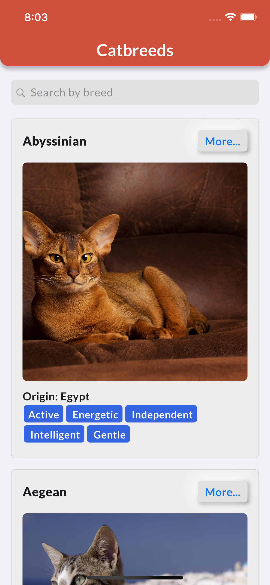
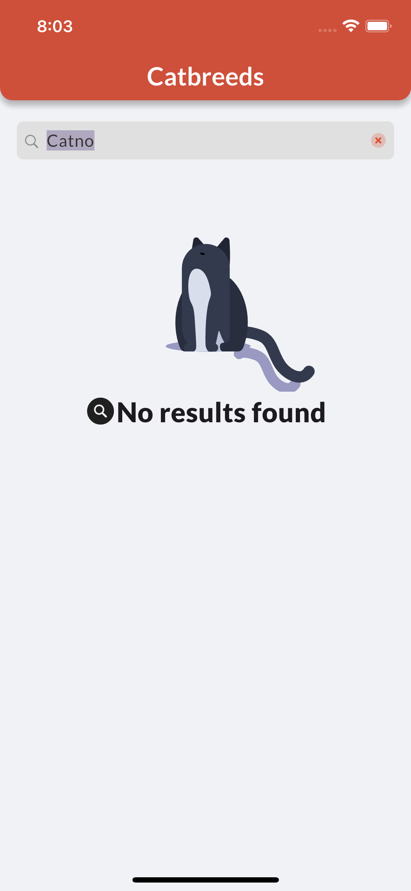
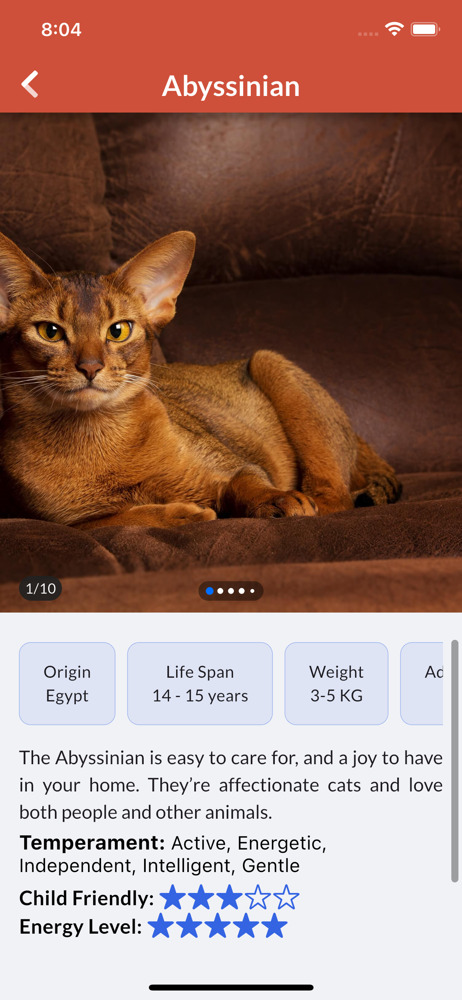

# Cat Breeds App

Cat Breeds App es una aplicación móvil desarrollada en Flutter que permite a los usuarios explorar diferentes razas de gatos. Los usuarios pueden ver detalles sobre cada raza, incluyendo una imagen, el origen y la inteligencia de cada raza.

## Arquitectura

La aplicación sigue una arquitectura modular y orientada a capas para asegurar una separación clara de responsabilidades y facilitar el mantenimiento y la escalabilidad del proyecto.

## Pantallas

### Splash Screen:


Muestra una imagen de carga y el título de la aplicación.

### Landing Page:




Lista todas las razas de gatos con una barra de búsqueda para filtrar por nombre.

### Detail Page:



Muestra detalles de una raza específica, incluyendo una imagen (que ocupa la mitad de la pantalla) y otra información relevante en una vista desplazable verticalmente.

## Funcionalidades

- Ver una lista de razas de gatos.
- Filtrar razas de gatos por nombre.
- Ver detalles de una raza específica, incluyendo imagen, origen e inteligencia.

## API

La aplicación consume datos de The Cat API.

- Endpoint: [https://api.thecatapi.com/v1/breeds](https://api.thecatapi.com/v1/breeds)

## Tecnologías Utilizadas

- **Flutter**: Framework principal para el desarrollo de la aplicación.
- **Dart**: Lenguaje de programación utilizado.
- **The Cat API**: Fuente de datos sobre las razas de gatos.

## Instalación

Para ejecutar este proyecto localmente:

1. **Clonar el repositorio**:

   ```bash
   git clone https://github.com/Carl0395/cat_breeds.git
   ```

2. **Navegar al directorio del proyecto**:

   ```bash
   cd cat_breeds
   ```

3. **Instalar las dependencias**:

   ```bash
   flutter pub get
   ```

4. **Ejecutar la aplicación**:

   ```bash
   flutter run
   ```

5. **Importante**
   
    Debe contar con el archivo de configuración de variables de entorno (.env) para el correcto funcionamiento

## Contribuciones

Las contribuciones son bienvenidas. Por favor, sigue los siguientes pasos:

1. Haz un fork del proyecto.
2. Crea una nueva rama (`git checkout -b feature/nueva-funcionalidad`).
3. Realiza tus cambios y haz commit (`git commit -m 'Añadir nueva funcionalidad'`).
4. Sube tus cambios (`git push origin feature/nueva-funcionalidad`).
5. Abre un Pull Request.

## Licencia

Este proyecto está bajo la Licencia MIT. Consulta el archivo [LICENSE](LICENSE) para más detalles.

## Agradecimientos

Agradecemos a [The Cat API](https://thecatapi.com/) por proporcionar los datos utilizados en esta aplicación.
